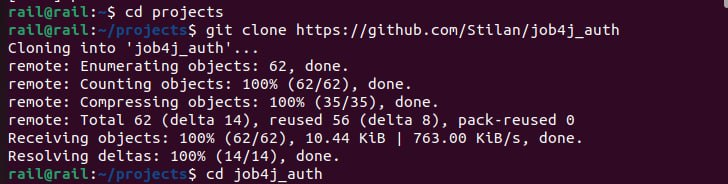
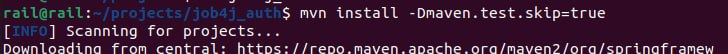
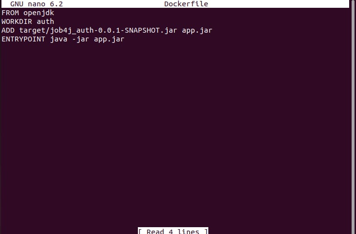
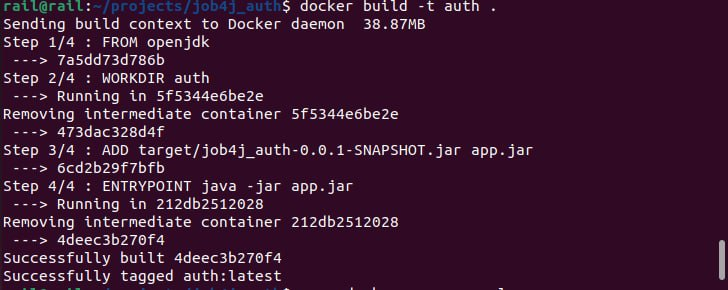
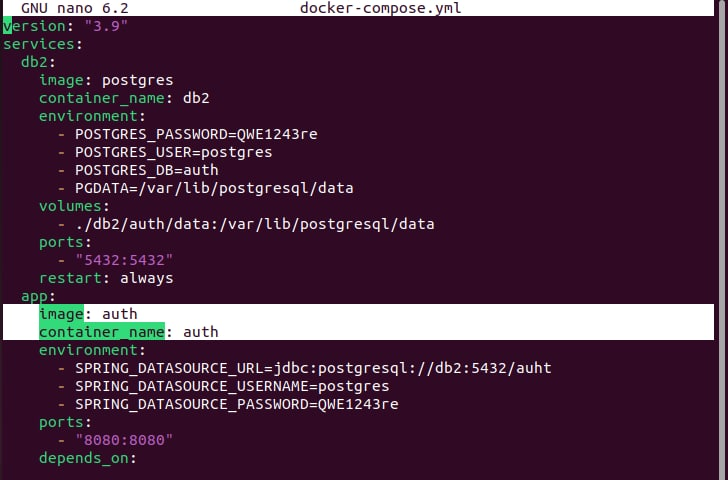
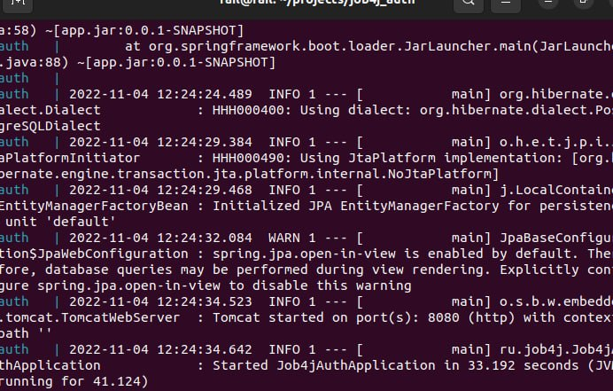
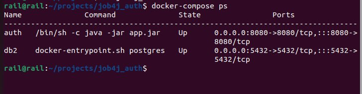

проект job4j_auth

RestFull API архитектура - это архитектура клиент-серверного приложения базирующаяся на 6 принципах.

1. Универсальный интерфейс взаимодействия. (Uniform Interface)

2. Запросы без состояния. (Stateless)

3. Поддержка кеширования. (Cacheable)

4. Клиент-серверная ориентация.

5. Поддержка слоев (Layered System)

6. Возможность выполнять код на стороне клиента (Code on Demand)

Как запустить приложение через Docker Compose.

1. Клонируем проект

2. Собираем проект

3. Создаем Dockerfile и прописываем скрипт сборки

4. Собирать

5. Пропишем docker-compose.yml

6. Запустим docker-compose up
Приложения запустилось

7. Для того чтобы посмотреть состояние контейнеров можно набрать команду

